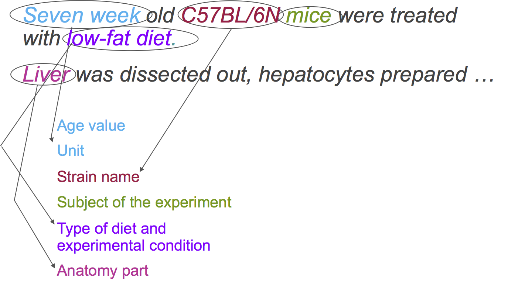
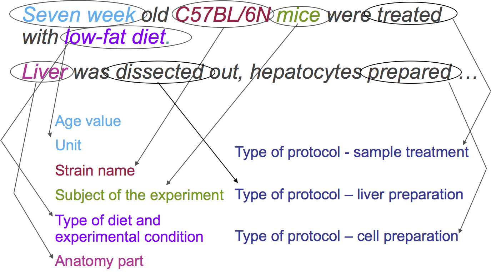
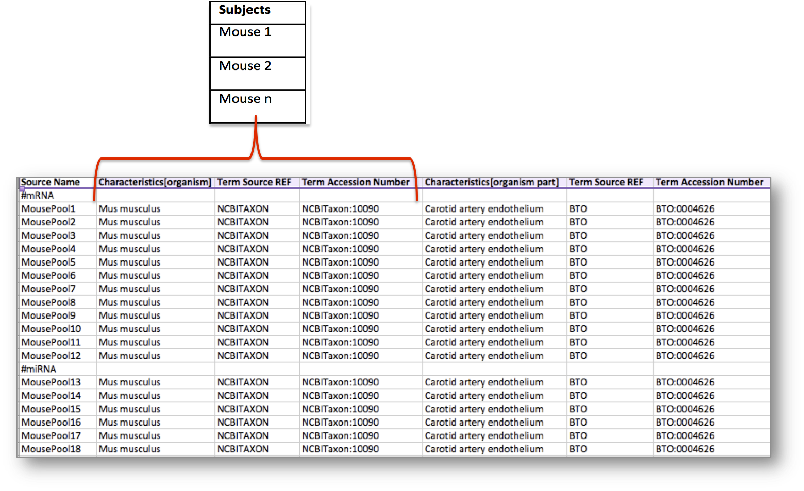
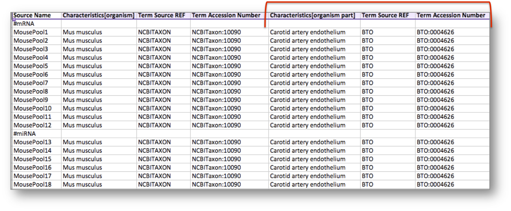

# Experimental Data Carpentry #
## Managing life science experimental metadata in tables ##

Author: Alejandra Gonzalez-Beltran <br>
Contributors: Eamonn Maguire, Milo Thurston, Philippe Rocca-Serra, Susanna-Assunta Sansone

Managing data, i.e. generating data and annotating data, involves a wide set of skills ranging from knowledge about the data in the specific domain being considered, plus general expertise on data management, enabling the storage, interpretation, preservation and re-use of data.

This tutorial will explore some of the concepts, required skills and available software tools useful for managing the data and metadata --- or data about the data --- maintained in tables, i.e. in spreadsheet programs. 

## Experimental Data ##

The last decade has seen a massive increase on the biological data being generated. 

Considering DNA sequencing technologies as an example, there has been an impressive improvement in instruments capacity during the last ten years, when moving from Sanger-based capillary sequencing methods to next generation, massively parallel sequencing technologies (see Mardis 2011). In addition to the technological enhancements, the sequencing costs have been dropping (see http://www.genome.gov/sequencingcosts/). 

Given the large amounts of data being generated, data management skills have become very important while doing research. 

Many international funding agencies and regulators have developed policies for data preservation, data management and data sharing. One of the objectives of the [BioSharing](http://www.biosharing.org) initiative, which we will explore throughout the tutorial, is to compile these policies in the [BioSharing Policy Registry](http://biosharing.org/policies)

> You can visit [BioSharing](http://www.biosharing.org) and explore [Policy Registry](http://biosharing.org/		policies) to find out about existing data sharing policies, categorised by organisation and country. 
	
> Is there any policy that is relevant to your domain of expertise?
	 
>	Do you know of any other policy that is not listed? Please, submit your contribution!
	

Some of the data policies require to write data management plans. In any case, it is important that you have a plan on how you will deal with the data you will generate or collect in your research/work. 


> What data do you collect or create within your work?
	 
> The Data Curation Centre has a checklist for data management plans that is very useful to think about your data needs.  
> Explore the document and consider your own answers. Focus first on the *Data Collection* section, as we will be discussing about metadata next: [DCC Data Management Plan Checklist] (http://www.dcc.ac.uk/resources/data-management-plans/checklist)

## Experimental Metadata ##

The data on their own is not enough to understand what the data are about and how they were generated. It is important to record information about the data generation process, not only for sharing the data with other people, but also for being able to understand one's own data in the future.

Let's see some examples on **how NOT to report experimental information**.

Imagine you found a folder entitled ```LS1_C2_LD_TP2_P1``` containing a file ```file1-fastq.gz```. So, what data does the file contains?

As the file extension is ```gz```, we can figure out that is a compressed file following the [GZip file format](http://en.wikipedia.org/wiki/Gzip#File_format). As it is a ```fastq``` file, we can assume it contains sequence information following the [FASTQ format](http://en.wikipedia.org/wiki/FASTQ_format).

But what is the sample this sequence data comes from?

We can guess that the folder name follows some coding system, but which one? It would be necessary to have that information spelled out.

The table below shows an example of what the data creator could have meant:

        Code  | Meaning
------------- | -------------
         LS1  | liver sample 1
          C2  | compound 2
          LD  | low dose
         TP2  | time point 2
          P1  | protocol 1

To make the data understandable, re-usable and, in principle, reproducible, it is crucial to provide metadata --- or data about the data --- including the experimental steps followed to produce the data, the characteristics of the samples, the protocols applied, the transformations applied and so on.

The experimental metadata provides background information including the experimental context, the methods, the information about the generated data and the experimental conclusions. Additionally, it enables data discovery through this contextual information.

So, in summary, **why the experimental metadata is important**?

* the data cannot be interpreted without it
* it is fundamental for enabling data accessibility, data integration and data discovery
* it is crucial for the experiment and data processing steps to be reproducible, in principle
* it is a requirement for the long term data archival and preservation

On the other hand, creating the metadata can be time-consuming. So, it is important to provide sufficient information to understand en enable re-use of the dataset, but at the same time striking a balance between sufficiency and practicability, by exploring the depth and breadth of the metadata provided.

Several communities in the different domains have worked on developing a variety of *metadata standards* focusing on specifying the content to be reported, the formats to be used and common terminologies for each of domains. By agreeing on what to report, in which format and what terminology to use, the metadata is harmonised across experiments and repositories, facilitating data discovery.

The [BioSharing](http://www.biosharing.org) initiative that we mentioned earlier, also contains registries for metadata standards and databases, as well as their relationships (e.g. what metadata standards a particular database implements?)

> Visit the [BioSharing](http://www.biosharing.org) site and explore the [Standards](www.biosharing.org/standards/) Registry.

In the next section, we will explore the different types of community-based metadata standards, providing examples for life science domains.

## Metadata Standards ##

Community-developed metadata standards can be classified into three categories:

* **Minimum Information Checklists**: these are guidelines to identify the core or essential information to report about a particular type of experiment 
* **Exchange Formats**: formats that allow information to flow from one system to another (enabling syntactic interoperability)
* **Terminologies**: emphasise on using the same term for referring to the same 'thing' in multiple systems (enabling semantic interoperability); these terminologies could include a wide-range of vocabularies, depending on how formal they are, from taxonomies to  ontologies.


> Within the [BioSharing Standards Registry](www.biosharing.org/standards/), for example, consider filtering the information about the standards according to their *standard type* (terminology artefact, exchange format, reporting guideline) 

Let's now explore each of these categories, highlighting some examples of each.

### Minimum Information Checklists ###

The different communities using specific techniques or performing particular types of experiments have realised along the years the importance of a common and regularised set of metadata describing both the biological and methodological contexts of the experiment. The main aims for these guidelines are (see *Taylor et al, 2008*):

1. to foster transparency when reporting experimental results
2. to improve data accessibility 
3. to support effective data quality assessment
4. to enable the unambiguous interpretation of the experimental results 
5. to facilitate, in principle, the reproducibility of the experiment
6. to strengthen the value of experimental with supporting information (and thus, the competitiveness of the data generators)

For example, scientists performing microarray-based transcriptomics experiments, identified the [Minimum Information about a Microarray Experiment (MIAME)](http://biosharing.org/bsg-000177) (See *Brazma et al, 2001*). The MIAME guideline identifies [the six more crucial elements](http://www.fged.org/projects/miame/#sthash.dGA1h2Hn.dpuf) for reporting a microarray-based experiment as:

1. the raw data files for each hybridisation
2. the normalised data for the hybridisations
3. the information about the samples, including the experimental factors (or independent variables) and their values
4. the information about the experimental design
5. the information about the array (e.g. gene identifiers and genomic coordinates)
6. the information about the protocols applied (e.g. about the normalisation method)
    
The [MIBBI Foundry](http://biosharing.org/standards/?selected_facets=isMIBBI:true) initiative was created to compile all the minimum information guidelines produced by different communities. This effort has now been embedded into the [BioSharing initiative](http://biosharing.org/), which maps the landscape of all categories of community standards in the life sciences, as well as maintaining a registry of databases and data sharing, data preservation and data management policies.

> Within the standards registry, explore the different checklists within the MIBBI Foundry (The resulting page should be this one: [MIBBI Foundry](http://biosharing.org/standards/?selected_facets=isMIBBI:true))

> To see those checklists whose domain is *clinical trials*, select the *facets* **standard type = reporting guideline** and **domains = clinical trial**. The result should be what you find in [this link](http://www.biosharing.org/standards/?q=&selected_facets=type_exact:reporting%20guideline&selected_facets=domains_exact:clinical%20trial).

> Select those checklists relevant to *homo sapiens* (by selecting the *facets* **standard type = reporting guideline** and **taxonomies = homo sapiens**)


### Exchange formats ###

The definition and use of structured formats enable validating the information and exchanging it between systems.

Different communities within the life sciences have defined specific structured formats for the exchange of information, whose content is often defined in minimum information guidelines (as described above), ranging from tabular structures to [eXtensive Markup Language (XML)](http://www.w3.org/XML/) documents. 

Following up the examples about microarray-based experiments, two formats have been defined:

1. [MicroArray Gene Expression Mark-up Language (MAGE-ML)](http://www.biosharing.org/bsg-000573)
2. [MicroArray Gene Expression Tabular (MAGE-TAB)](http://www.biosharing.org/bsg-000080)

MAGE-ML is an XML-based format, while MAGE-TAB is a simple spreadsheet-based format. Given that life scientists are familiar with tabular formats (or spreadsheets), MAGE-TAB has been more widely used than MAGE-ML.

> Visit BioSharing record about [MIAME checklist](http://biosharing.org/bsg-000177) and explore the information providing. In particular see the box on **related standards** and those that are **exchange formats**

> The Short Read Archive XML format is used in databases storing sequencing data. Visit the corresponding BioSharing record ([SRA-XML in BioSharing](http://www.biosharing.org/bsg-000084)), explore the **Implementing Databases** section and the **Schemas** section, where you can download and visualise each of the schemas.

> ISA-Tab is a general-purpose tabular format for experimental descriptions, explore its record in BioSharing, for example, the **Implementing Databases**, **Related Standards** and **Publications** sections


### Terminologies ###

Natural language, i.e. free text or plain English (or any other language, for that matter), is essentially ambiguous. We have many different ways of conveying the same, or similar, information. One example is related to the use of synonyms for the same concept. Clearly, this is also true when describing experimental information. For example, a process referring to *information acquisition* is equivalent to *data collection* (i.e. they are synonyms). This is an issue when considering data interpretation and integration.

Let's consider the following descriptions of the experimental setup:

-><-

<br>

First, let's identify each of the elements' types within these phrases:

-><-

<br>

Additionally, we can identify the different protocols applied:

-><-

This means, that each of the elements is an instance of the type identified. If we have a structured representation of these elements, we will be able to compare experimental setups.

But, how we can ensure that the same terminology is harmonised across experimental descriptions to ensure that the meaning of the description is unambiguous (so everyone is speaking the same language)? Otherwise, comparison of experiments, discovery of data across experiments, accessibility of the data and integration will not be possible.

To solve this issue, multiple communities have work on the development of terminologies or structured vocabularies. These vocabularies can range from list of keywords or tags up to ontologies, according to the level of formalism used.

-><-

In the case of tags or keywords, the matching is purely syntactic (or textual). 

Controlled vocabularies are defined by a list of terms, which should be distinct and unambiguous, having a clear definition and including synonyms (i.e. two or more words that have the same meaning) and homographs (i.e. two or more words with the same spelling, not necessarily the same pronunciation, and with different meanings). These are *controlled* vocabularies because addition/deletion and modification of terms is managed following specific rules.

Taxonomies are controlled vocabularies where terms are organised in a hierarchy, by identifying *broader* or *narrower* terms. 

Thesaurus are taxonomies with added associative relationships among terms (e.g. a term is identified as being *related to* other terms).

Finally, ontologies represent the information in a formal way, based on formal logics, using knowledge representation languages. These languages define a grammar to express something meaningfully and unambiguously within the domain of interest.

In life sciences, the [Gene Ontology (GO)]()

**Ontology/Vocabulary Portals**

[National Center for Biomedical Ontology (NCBO)](http://www.bioontology.org/) [BioPortal](http://bioportal.bioontology.org/)

The [Linked Open Vocabularies (LOV)]() portal contains terminologies re


#### Semantic Annotation ####








